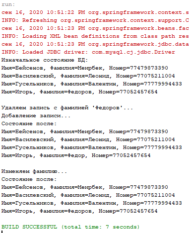

# GVS03_Spring_Beans

Решение 3 задания, 3 вариант.



```
CREATE TABLE IF NOT EXISTS `gvs_demo`.`my_phonebook` (
  `id` int(11) NOT NULL AUTO_INCREMENT,
  `firstName` VARCHAR(45) NULL DEFAULT NULL,
  `lastName` VARCHAR(45) NULL DEFAULT NULL,
  `number` VARCHAR(11) NULL DEFAULT NULL,
  PRIMARY KEY (`id`)
) ENGINE=InnoDB DEFAULT CHARSET=utf8;

INSERT INTO my_phonebook (firstName, lastName, number) VALUES ("Бейсенов", "Меирбек", "77479873390");
INSERT INTO my_phonebook (firstName, lastName, number) VALUES ("Василевский", "Леонид", "77075211004");
INSERT INTO my_phonebook (firstName, lastName, number) VALUES ("Гусельников", "Валентин", "77779994433");
```
